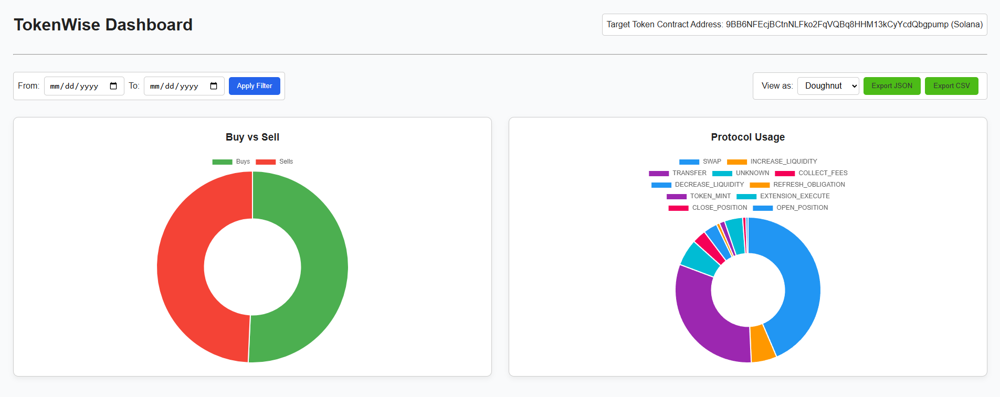

# 🚀 TokenWise — Real-Time Wallet Intelligence on Solana

**TokenWise** is a real-time intelligence platform that monitors and analyzes wallet behavior for a specific SPL token on the **Solana blockchain**. It identifies the **top 60 token holders**, captures **live transaction activity**, highlights **protocol usage** (e.g., Jupiter, Orca), and presents it all on a clean, interactive dashboard.

---

## 🔧 Tech Stack

| Layer         | Stack                       |
|--------------|-----------------------------|
| Frontend     | React.js + Vite + Chart.js  |
| Backend      | Node.js + Express + TypeScript |
| Blockchain   | @solana/web3.js             |
| Database     | Prisma ORM + Postgres         |
| Charts       | chart.js (with Pie, Doughnut, Bar, Polar) |

---

## 🛠️ Features

- 🧾 Discover **top 60 wallets** holding a given token
- 🔄 Monitor **real-time** buys/sells with:
  - Direction (Buy/Sell)
  - Amount, Timestamp, Protocol
- 📊 Visual dashboard with:
  - Pie / Doughnut / Bar / Polar charts
  - Toggle chart type
  - Time-based filters (from/to)
  - JSON and CSV export support
- 🧠 Protocol usage breakdown (Jupiter, Raydium, Orca, etc.)
- 🕰️ Custom date range insights

---

## ⚙️ Setup Instructions

### ✅ Prerequisites

- [Node.js v18.x+](https://nodejs.org/)
- [npm v9+](https://www.npmjs.com/)
- Git
- Postgresql (Prisma)

---

### 🔌 Backend Setup

```bash
cd tokenwise/backend

# Install dependencies
npm install

# Initialize the database
npx prisma generate
npx prisma db push

# Start backend server
npm run dev

Example .env file
Create backend/.env:

env
DATABASE_URL="file:./dev.db"
PORT=4000
```

### 💻 Frontend Setup

```bash
cd tokenwise/frontend

# Install dependencies
npm install

# Start the dev server
npm run dev
```


- The frontend will run on: 👉 http://localhost:5173
- Backend runs on:👉 http://localhost:4000

##🧪 Example API Usage
- Get summary insights: GET http://localhost:4000/api/insights/summary
- Optional query params: ?from=2025-07-01&to=2025-07-09

Export data
- GET /api/insights/export/json   # Download JSON
- GET /api/insights/export/csv    # Download CSV

🖼️ Dashboard Screenshots
📌 Add screenshots here in the repo folder and embed them like:



🧠 Notes
- Chart types include: Pie, Doughnut, Bar, Polar Area
- Date filters dynamically fetch filtered data
- CSV & JSON export work even with applied filters
- Backend written in clean modular structure

📌 Future Enhancements
- Real-time WebSocket updates for transactions
- Authentication and user-defined tokens
- Advanced charts (stacked, timeseries)
- Multi-token tracking support
